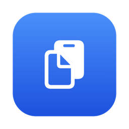

<p align="center">
  
</p>

<h1 align="center">Jotter</h1>

<p align="center">
  A tiny, free, open-source clipboard history manager for the macOS menu bar.<br>
  One Swift file. No dependencies. Nothing ever leaves your Mac.
</p>

## Features

- Watches the clipboard and keeps your recent copies (text **and** images)
- Click the menu bar icon → list opens with a fuzzy search field focused
  ("cbm" matches "ClipboardManager")
- Press **⌘⇧V** anywhere → keyboard-first list: navigate with ↑/↓ + Return,
  or press **1–9** to grab an item instantly
- **Favorites**: ⌥-click an item (or press ⌥1–⌥9) to pin it — it gets
  a ★, stays at the top of the list, and is never pushed out by new
  copies. ⌥-click again to unpin.
- **Favorite as you copy**: hold ⌘C a beat longer (or press it twice
  within a second or two) and the item is pinned the moment it's
  captured — no permissions or key monitoring involved; Jotter just
  notices the same content arriving twice in quick succession.
- Copied colors (`#ff5733`, `ff5733`, `rgb(255, 87, 51)`, `rgba(...)`)
  are shown in their own color with a swatch
- Copied images show a thumbnail — hover for a large preview, click the
  preview (or "Copy Image") to put it back on the clipboard
- Native Settings window (⌘, from the menu):
  - **General**: start at login, how many copies to keep (5–1000),
    and where history is saved
  - **History**: browse everything saved with timestamps and character
    counts, multi-select and delete
  - **About**: version, support contact, privacy statement
- History persists across restarts:
  - text → `<save folder>/history.json`
  - images → `<save folder>/images/*.png`
  - default save folder: `~/Library/Application Support/Jotter/`
- Skips clipboard data marked as concealed (password managers)
- Notch-friendly: if a crowded menu bar hides the icon, ⌘⇧V (or
  re-opening the app) pops the list at your cursor instead

## Install

**Requires macOS 13 or later.**

1. Download `Jotter-x.y.zip` from the
   [Releases](../../releases) page and unzip it.
2. Drag `Jotter.app` into `/Applications`.
3. First launch: right-click the app → **Open** (the app is signed
   ad-hoc, not notarized, so Gatekeeper asks once). Alternatively:
   `xattr -d com.apple.quarantine /Applications/Jotter.app`
4. Look for the clipboard icon in your menu bar, or press **⌘⇧V**.

## Build from source

No Xcode project needed — just the Xcode command-line tools:

```sh
./build-app.sh              # build + install to /Applications + launch
./build-app.sh --no-install # just build ./build/Jotter.app
./build-app.sh --release    # build + zip ./build/Jotter-<version>.zip
```

The script compiles `Jotter.swift`, wraps it in an `.app` bundle
(Info.plist, generated icon, ad-hoc signature) so everything works,
including start-at-login.

For a quick throwaway run without a bundle:

```sh
swiftc -parse-as-library Jotter.swift -o jotter && ./jotter
```

Everything works this way except start-at-login (which needs a real
`.app` bundle). You can also build with Xcode: create a macOS App
project named **Jotter**, drop in `Jotter.swift`, and turn App Sandbox
off (or keep the default save folder).

## Project layout

```
Jotter.swift        the entire app: model, persistence, color parsing,
                    settings UI (SwiftUI), menu bar app (AppKit)
build-app.sh        builds, packages, signs, installs
previous-versions/  earlier iterations, kept as a build-up history:
                    basic menu → search → fuzzy matching → hotkey
assets/             icon used in this README
```

## Troubleshooting

**No icon in the menu bar?** Your menu bar is full — on notched
MacBooks, macOS silently hides status items that don't fit, newest app
first. Jotter still works: press **⌘⇧V** or double-click the app in
Finder and the list opens at your cursor. To make room, hold ⌘ and
drag icons you don't need off the menu bar.

**⌘⇧V does nothing?** Another clipboard manager (e.g. Clipy) may have
registered the same hotkey first. Quit the other app or change its
shortcut.

## Privacy

Jotter runs entirely on your Mac. History is stored as plain JSON/PNG
files in the folder you choose — nothing is transmitted anywhere.
Clipboard data flagged as concealed by password managers is never
recorded. Remember that anything sensitive you copy stays in the
history files until you delete it.

## Contributing

Issues and pull requests are welcome — see
[CONTRIBUTING.md](CONTRIBUTING.md).

## License

[MIT](LICENSE) © 2026 Ryan Chan Kwan Ho

## Support

Email [ryanchankwanho@gmail.com](mailto:ryanchankwanho@gmail.com?subject=%5BJotter%20Support%5D%20)
with the subject prefix **[Jotter Support]**.
